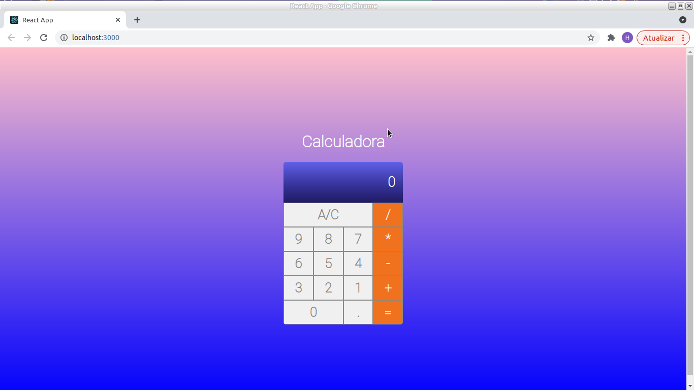

<h1 align='center'>Calculadora Em React.JS</h1>

<h2 align='center' >Esta aplicação em React.JS é uma Calculadora simples, usando JavaScript<h2>

 Aplicação separada por pastas na <b>"src"</b>
temos um aquivo <b>"index.js"</b> a onde é 
responsável por rendenizar o arquivo HTML, que 
esta dentro da pasta <b>"public"</b>. E ainda 
dentro da pasta <b>"src"</b> temos 3 pastas 
<b>"components, font, main"</b>, na components 
temos mais 2 novas pastas <b>"button"</b> e 
<b>"display"</b>, na <b>"button"</b> temos
 2 arquivos, <b>"button.css"</b> responsável por 
 dar estilos nos  botoes, e o outro arquivo é
<b>"button.jsx"</b> que é os botoes da 
calculadora. Já a pasta <b>"display"</b> temos 
tambem  arquivo <b>"display.css"</b> para estilo,
 e outro arquivo <b>"display.jsx"</b> 
resposavel de renderizar os valores das operações. 
E na pasta <b>"font"</b> temos a fonte 
<b>"Roboto-Thin.ttf"</b> que foi utilizada nesta aplicaçao. 
Ja a ultima pasta <b>"main"</b> temos arquivos 
<b>".css"</b> e <b>".jsx"</b> que é a onde fica toda logica da 
calculadora. 

 
<h2>Tecnologias usadas</h2>

JavaScript

React.JS

css

